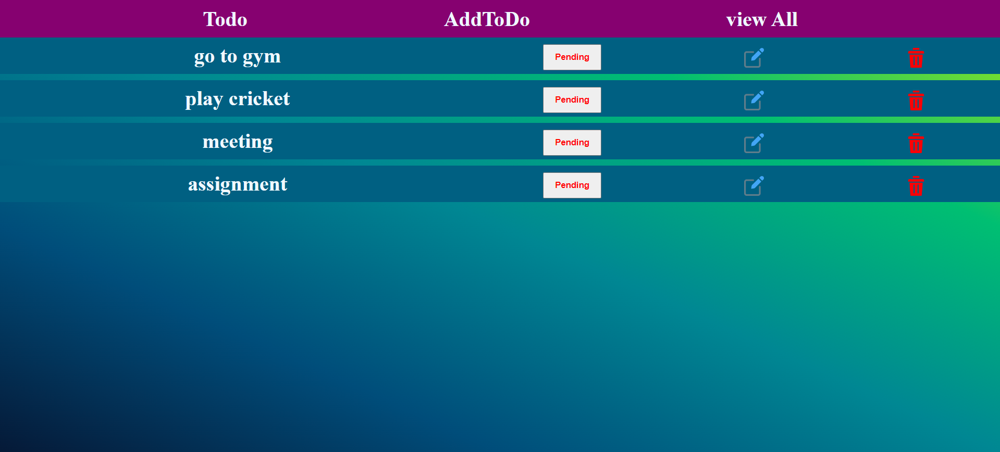
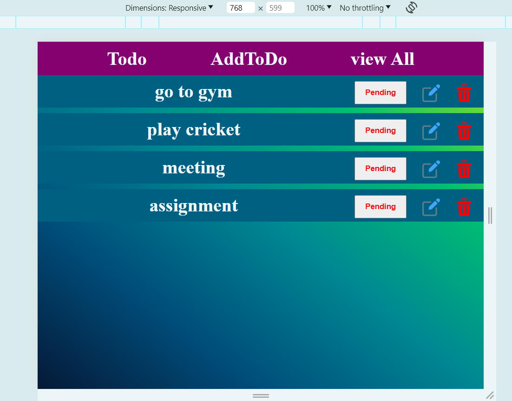
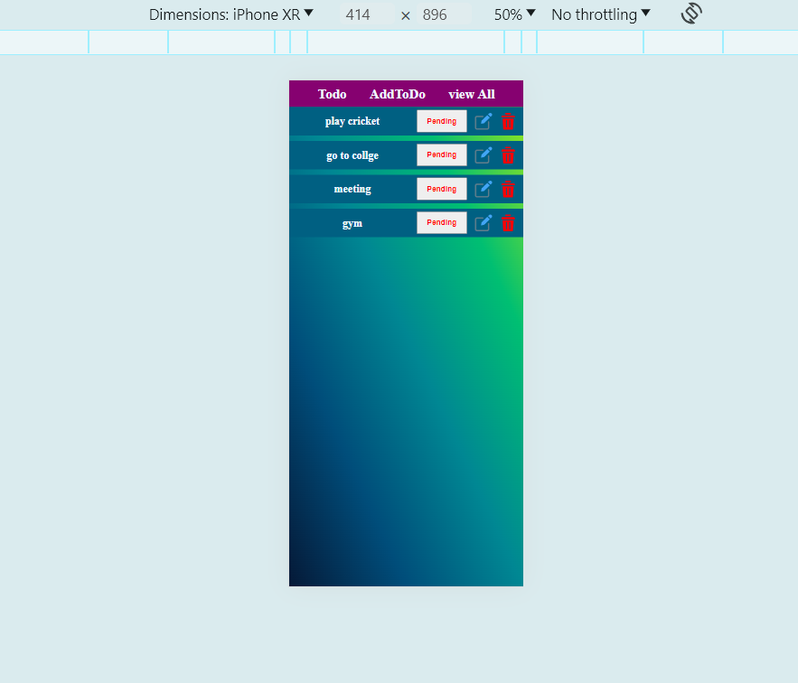

# TODO Application

This is a simple ToDo Application created using react.

### Hosted Link

[Live Demo](https://react-todo-shaikh082.netlify.app/)

## Features

1. Add ToDo
2. Update ToDo
3. Delete ToDo
4. Toogle ToDo (completed/pending)

## Getting Started

### Prerequisites

Make sure you have Node.js and npm installed on your machine.

### Installation

1. Clone the repository:

```
https://github.com/shaikhsohel0082/TODO.git
```

2. Navigate to the project directory:

```
cd TODO
```

3. Install the dependencies:

```
npm install
```

### Running the Application

To start the development server, run:

```
npm start
```
### ScreenShots
Dekstop view

Tablet View

Mobile View



### Contributing

If you want to contribute to this project, feel free to open issues or pull requests. Contributions are welcome!
